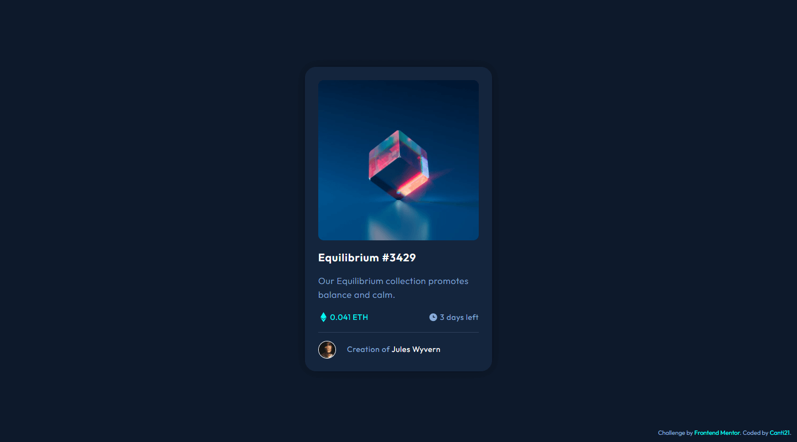
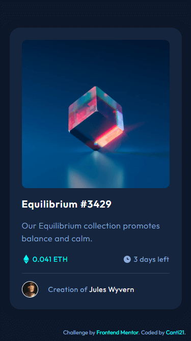
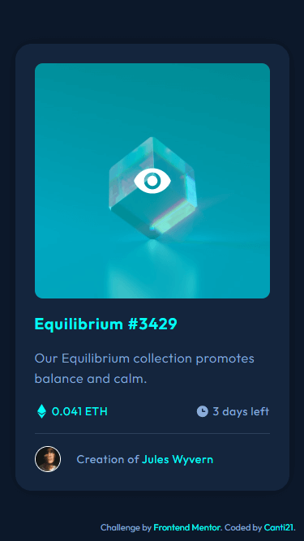

# Frontend Mentor - NFT preview card component

This is a solution to the [NFT preview card component challenge on Frontend Mentor](https://www.frontendmentor.io/challenges/nft-preview-card-component-SbdUL_w0U).


## Overview

### 🎯 The challenge

Users should be able to:

- View the optimal layout depending on their device's screen size
- See hover states for interactive elements

The design references are in the [design folder 📁](./design/).

### 📷 Screenshots

🖥️ Desktop View:



📱 Mobile View:



**🌟 Active States:**



### 🔗 Links

- Solution URL: [Solution](https://www.frontendmentor.io/solutions/nft-preview-card-component-t6HTduVrPo)
- Live Site URL: [Deploy](https://canti21.github.io/FEM-nft-card-component/)

## 💭 My process 

### 🛠 Built with 

- Semantic HTML5 markup
- CSS Transitions
- Flexbox
- CSS Grid
- Mobile-first workflow

### 📖 What I learned

How to create the image hover effect

For the image container, I used a **figure** tag
```html
<figure class="image-container">
  
  <span class="active-state fade"><span class="view-icon"></span></span>
</figure>
```

Now, for the CSS...

```css
.image-container
{
  position: relative;
  overflow: hidden;
}

/* This adds a semi-transparent color over the image */

.image-container .active-state
{
    display: block;
    position: absolute;
    inset: 0; /* top, left, right and bottom are set to 0 */
    width: 100%;
    height: 100%;
    background-color: rgba(0, 255, 247, 0.5);
}

/* This switches between the two opacity values */
.image-container .active-state.fade
{
    opacity: 0;
}

.image-container:hover .active-state.fade
{
    opacity: 1;
    cursor: pointer;
}

/* Finally this makes a smooth transition */

.image-container .active-state,
.image-container img,
{
    transition: 200ms ease-in-out;
}
```

### 🌐 Useful resources

- [Image Hover Effect](https://youtu.be/tF3RE5CGt9U) - This helped me with the active state of the image.

## 🐱‍👤 Author

- Frontend Mentor - [@Canti21](https://www.frontendmentor.io/profile/Canti21)
- Twitter - [@Canti2100](https://www.twitter.com/Canti2100)
